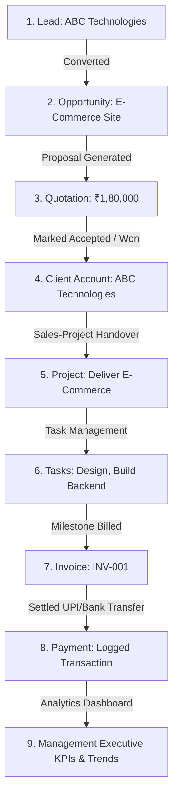

# CRM & Business Operations Platform

A production-grade MERN stack Customer Relationship Management (CRM) and Business Operations Platform. It integrates leads management, sales pipeline pipeline, itemized quotations generator, project handovers, task trackers, financial invoicing/payments, and role-based analytical dashboards into a single, unified enterprise system.

---

## 🏢 Business Workflow Architecture

The platform coordinates the entire client operations lifecycle:



---

## 🛠️ Complete Feature Summary

### 1. Lead Management
* **Lead Record**: Captures name, company, requirement, source, notes, and assigns a salesperson.
* **Actions**: Search leads by name, filter by status/source, page results, and assign salespeople.

### 2. Pipeline & Opportunities
* **Funnel Stages**: `New` ➔ `Qualified` ➔ `Proposal` ➔ `Negotiation` ➔ `Won` ➔ `Lost`.
* **Kanban Board**: Drag-and-drop HTML5 Kanban board allows moving opportunities between columns, automatically updating database stages.
* **Lead Conversion**: Creating an opportunity from a lead automatically converts the lead status to "Converted".

### 3. Activities Feed
* **Type of logging**: Logs Calls, Emails, Meetings, and internal Notes on Leads, Opportunities, and Client accounts.
* **Activity Timeline**: Interactive vertical timelines display transaction history.
* **Follow-ups**: Integrated with notifications. When scheduling a follow-up date, it schedules a "Pending" alert.

### 4. Client 360° Profile
* **Unified Profile**: A central tabbed page detailing all contact facts, associated pipeline deals, logged activities timeline, and invoice history.
* **Auto-Conversion**: When an Opportunity is won, it can be converted to Client with one click, extracting contacts from the original Lead.

### 5. Proposals & Quotations
* **Itemization**: Form supports adding multiple line items with specific quantities, prices, discounts, and taxes.
* **Print Layout**: In-app printable template with itemized subtotals and grand totals.

### 6. Handover & Projects
* **Sales ➔ Project Handover**: Clicking "Handover" on a Won Opportunity automatically redirects, converts to Client (if needed), and prefills the Project creation form with budgeted deal values, scope requirements, and linked opportunity.
* **Progress Tracking**: Overall project progress is computed dynamically based on the ratio of completed tasks.
* **Task Board**: Task Kanban columns (Todo, In Progress, Review, Completed) with drag-and-drop status transitions.

### 7. Finance & Invoicing
* **Invoice Generation**: Select client and projects, specify due dates, and add billing items.
* **Payment Log**: Record UPI/Bank transfers. It auto-updates the paid balance, calculates remaining due amount, and transitions invoice status (Draft ➔ Sent ➔ Partially Paid ➔ Paid).

### 8. Notifications & Analytics
* **Header Alerts**: Shows due follow-ups, payment receipts, and system notifications.
* **Management Dashboard**:
  * Real-time metrics: Total Revenue, Outstanding Balances, Active Projects, Pipeline Count.
  * Interactive charts: Revenue Trends (cashflow timeline), Sales Pipeline (deal counts by stage), Project status breakdown.

---

## 🔑 Default Credentials & Role Access

On database startup, default accounts are seeded for verification:

| Role Name | Email Address | Password | Visible Sections & Permissions |
| :--- | :--- | :--- | :--- |
| **Admin** | `admin@crm.com` | `admin123` | Full access to all modules, including user administration and deactivations. |
| **Management** | `management@crm.com` | `management123` | Full view and create permissions across CRM, Projects, Finance, and Users. |
| **Sales** | `sales@crm.com` | `sales123` | Access to Leads, Sales Opportunities, Activities, and Quotations. |
| **Project Manager** | `pm@crm.com` | `pm123456` | Access to Clients profiles, Projects dashboards, and Tasks board. |
| **Employee** | `employee@crm.com` | `employee123` | Access to Tasks assigned to them. Can only see details of projects they are assigned to as team members. |
| **Finance** | `finance@crm.com` | `finance123` | Access to Clients profiles, Invoices billing, and recorded Payments history. |

---

## 🛠️ Technology Stack

* **Frontend**: React (Vite), Ant Design, Axios, React Router v6.
* **Backend**: Node.js, Express.js, JWT, Bcrypt.js, Mongoose.
* **Database**: MongoDB.

---

## ⚙️ Installation & Setup

### Prerequisites
* [Node.js](https://nodejs.org/) installed locally.
* [MongoDB](https://www.mongodb.com/) running locally.

### Setup Environment Variables
Create a `.env` file in the `server` directory:
```env
PORT=5000
MONGO_URI=mongodb://127.0.0.1:27017/crm_platform
JWT_SECRET=supersecret_crm_jwt_token_key_12345
NODE_ENV=development
```

### Running Backend Server
```bash
cd server
npm install
npm run dev
```

### Running Frontend Client
```bash
cd client
npm install
npm run dev
```
Open `http://localhost:5173/` in your browser.

---

## 🧪 Running Verification Tests
Execute backend schema validations locally:
```bash
cd server
node test.js
```
